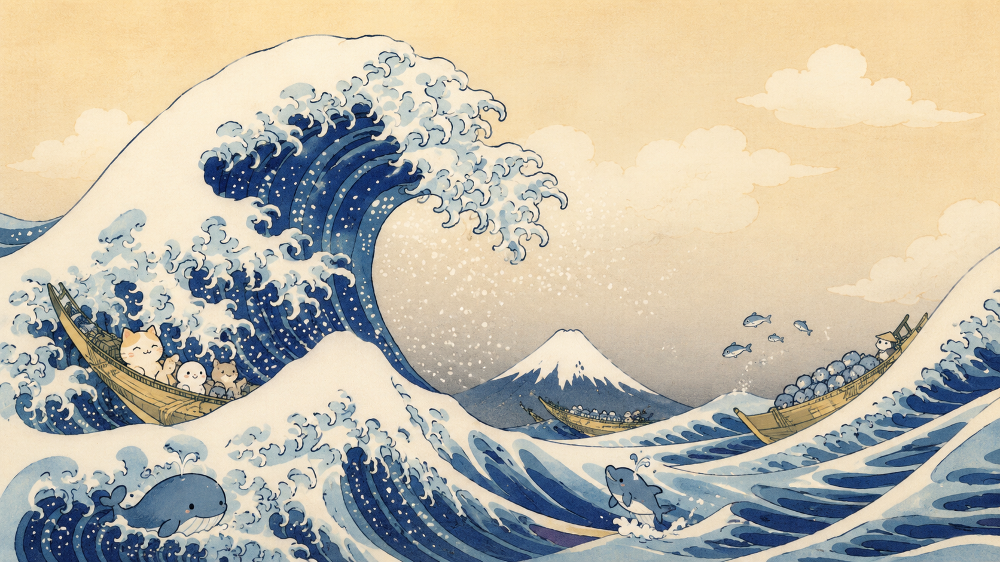

# Friendly Wave — an Omarchy Kids theme

A bright, airy **light** theme for kids: the calm warm-paper **Flexoki Light** palette paired with OldJobobo's kid-safe "friendly wave" wallpaper — a cuddly reimagining of Hokusai's *Great Wave* with a cat and friends riding it out.



> The preview is a placeholder (the wallpaper itself). Replace it with a real desktop screenshot after installing.

## Install

```bash
omarchy-theme-install https://github.com/kenhara/omarchy-friendly-wave-theme
```

While this repo is private (pre-review), install over SSH instead:

```bash
omarchy-theme-install git@github.com:kenhara/omarchy-friendly-wave-theme.git
```

Then choose **Friendly Wave** in the Omarchy theme picker.

## What's inside

- `colors.toml` — the **Flexoki Light** palette, reused verbatim (`mode = "light"`)
- `backgrounds/` — kid-safe wallpaper(s): `friendly-wave.png`
- `icons.theme` — `Yaru-blue`
- `unlock.png` — lock-screen background

Nothing here is invented: the colors are an existing Omarchy palette, and the only new material is the reviewed kid wallpaper. See [`NOTES.md`](NOTES.md) for the full rationale.

## Credits

- **Wallpaper & visual design:** OldJobobo
- **Palette:** reused from Omarchy's **Flexoki Light** theme
- **Draft implementation:** Harris / kenhara
